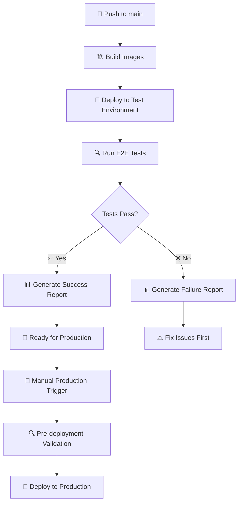
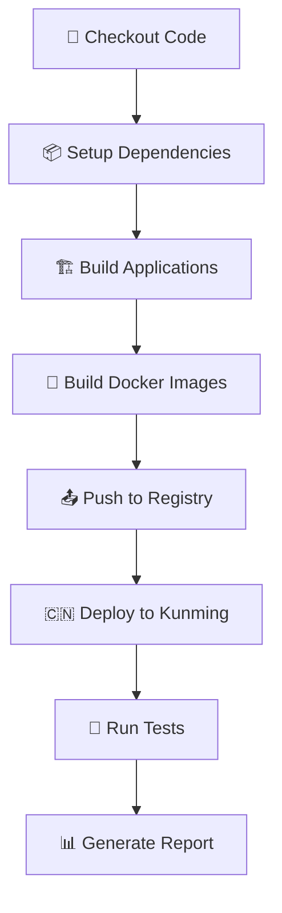
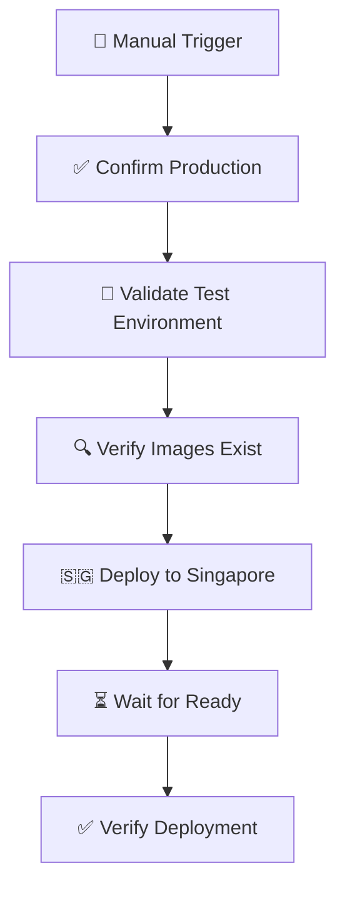

# 🚀 GitHub Actions Workflows

This directory contains the GitHub Actions workflows for the Jiffoo Mall Core project.

## 🎯 **NEW: Environment Separation Strategy**

We now implement **DevOps best practices** with proper environment separation:

### **🧪 Test Environment (Automatic)**
- **Trigger**: Every push to `main` branch
- **Target**: Kunming cluster (昆明测试环境)
- **Purpose**: Automatic testing and validation
- **Workflow**: `deploy.yml` (modified)

### **🚀 Production Environment (Manual)**
- **Trigger**: Manual only after test validation
- **Target**: Singapore cluster (新加坡生产环境)
- **Purpose**: Production deployment with safety checks
- **Workflow**: `deploy-production-manual.yml`

## 📋 Available Workflows

### 1. 🧪 Main Deployment (`deploy.yml`) - **UPDATED**

**Purpose**: Build and deploy to test environment, with optional production deployment.

**Triggers**:
- **Automatic**: Push to `main` branch → Deploy to test environment
- **Manual**: `workflow_dispatch` → Deploy to specific environment

**Features**:
- **Multi-environment support**: Production (Singapore), Staging, Test (Kunming)
- **Flexible deployment types**:
  - `full`: Build + Deploy (default)
  - `build-only`: Only build and push Docker images
  - `deploy-only`: Only deploy (uses existing images)
- **Smart testing**: Option to skip tests for hotfixes
- **Multi-service build**: Builds 8 different services in Docker containers
- **Kubernetes deployment**: Automated deployment to K8s clusters

**Usage**:
```yaml
# Manual trigger with options
Environment: production | staging | test
Deploy Type: full | build-only | deploy-only
Skip Tests: false | true (for hotfixes)
```

**Environments**:
- **🇸🇬 Singapore Production**: Main production cluster (47.79.3.27:6443)
- **🇨🇳 Kunming Test**: Development/test cluster (home.chfastpay.com:6443)

### 2. 📚 Documentation Deployment (`deploy-docs.yml`)

**Purpose**: Build and deploy project documentation (public and internal).

**Triggers**:
- **Automatic**: On push to `main` when docs files change
- **Manual**: `workflow_dispatch` with options

**Features**:
- **Smart change detection**: Only deploys what changed
- **Dual documentation**:
  - **📖 Public docs**: Deployed to GitHub Pages (docs.jiffoo.com)
  - **🔒 Internal docs**: Deployed as Docker container
- **Flexible deployment**: Choose what to deploy manually

**New Flow**:
```
Push to main → Build → Deploy to Test → Run Tests → Generate Report
                                                  ↓
                                            ✅ Pass: Ready for Production
                                            ❌ Fail: Fix Issues First
```

**Manual Options**:
```yaml
Target Environment: production | staging | test
Deployment Type: full | build-only | deploy-only
Skip Tests: false | true
```

### 2. 🚀 Manual Production Deployment (`deploy-production-manual.yml`) - **NEW**

**Purpose**: Safe production deployment with pre-deployment validation.

**Trigger**: Manual only (`workflow_dispatch`)

**Safety Features**:
- ✅ Requires explicit confirmation
- ✅ Validates test environment first
- ✅ Verifies Docker images exist
- ✅ Production environment protection

**Manual Options**:
```yaml
Test Run ID: (optional) Reference test run
Confirm Production: true (required)
Image Tag: (optional) Specific image tag
```

### 3. 🧪 Test Environment Only (`deploy-test.yml`) - **NEW**

**Purpose**: Dedicated test environment deployment with comprehensive validation.

**Trigger**: Push to `main` branch

**Features**:
- 🏗️ Build and push Docker images
- 🚀 Deploy to Kunming test cluster
- 🧪 Run end-to-end tests
- 📊 Generate detailed test reports

### 4. 📚 Documentation Deployment (`deploy-docs.yml`)

**Purpose**: Deploy documentation sites.

**Usage**:
```yaml
# Manual trigger options
Documentation Type: both | public-only | internal-only
Force Rebuild: false | true
```

## 🏗️ New Workflow Architecture

### **🎯 Environment Separation Flow**


### **🔄 Automatic Test Deployment**


### **🚀 Manual Production Deployment**


## 📖 Usage Guide

### **🧪 For Development (Test Environment)**

1. **Push code to main branch**:
   ```bash
   git push origin main
   ```

2. **Automatic process**:
   - ✅ Code builds automatically
   - ✅ Deploys to Kunming test environment
   - ✅ Runs comprehensive tests
   - ✅ Generates test report

3. **Check results**:
   - Go to Actions tab
   - View the deployment summary
   - Check test validation results

### **🚀 For Production Deployment**

1. **Ensure test environment is healthy**:
   - Check latest test deployment passed
   - Verify all services are working

2. **Trigger production deployment**:
   - Go to Actions tab
   - Click "Manual Deploy to Production"
   - ✅ Check "确认部署到生产环境"
   - Click "Run workflow"

3. **Monitor deployment**:
   - Watch the deployment progress
   - Verify production services

### **🔧 For Hotfixes**

1. **Emergency production deployment**:
   - Use main `deploy.yml` workflow
   - Select "production" environment
   - Check "Skip Tests" if needed
   - ⚠️ Use with caution!

## 🛡️ Safety Features

### **Test Environment Protection**
- ✅ Automatic deployment on every push
- ✅ Comprehensive test validation
- ✅ Detailed failure reporting
- ✅ No impact on production

### **Production Environment Protection**
- ✅ Manual trigger only
- ✅ Explicit confirmation required
- ✅ Pre-deployment validation
- ✅ Test environment verification
- ✅ Docker image existence check
- ✅ Environment-specific secrets

## 🎯 Benefits

### **For Developers**
- 🚀 **Fast Feedback**: Immediate test deployment on push
- 🔍 **Early Detection**: Issues caught in test environment
- 📊 **Clear Reports**: Detailed test results and next steps
- 🛡️ **Safe Development**: No accidental production deployments

### **For Operations**
- 🎯 **Controlled Releases**: Manual production deployment
- 🔒 **Risk Reduction**: Multiple validation layers
- 📈 **Better Visibility**: Clear deployment status
- 🔄 **Easy Rollback**: Separate environments for quick recovery

### **For Business**
- ✅ **Higher Quality**: Thorough testing before production
- ⚡ **Faster Development**: Automated test environment
- 🛡️ **Lower Risk**: Reduced production incidents
- 📊 **Better Tracking**: Clear deployment history

## 🔧 Configuration

### Required Secrets
- `GITHUB_TOKEN`: For container registry access
- `SINGAPORE_CLIENT_CERT`: Singapore K8s cluster certificate
- `SINGAPORE_CLIENT_KEY`: Singapore K8s cluster key
- `KUNMING_CLIENT_CERT`: Kunming K8s cluster certificate
- `KUNMING_CLIENT_KEY`: Kunming K8s cluster key

### Self-Hosted Runners
- **`universal`**: M1 Max runner for building (supports ARM64)
- **`singapore`**: Singapore-based runner for production deployment

## 📊 Monitoring & Debugging

### Workflow Status
- Each workflow provides detailed step summaries
- Build artifacts are tagged with branch and commit SHA
- Deployment status is verified with `kubectl` commands

### Common Issues
1. **Build failures**: Check Node.js/pnpm versions and dependencies
2. **Docker build issues**: Verify Dockerfile paths and build context
3. **Deployment failures**: Check K8s cluster connectivity and secrets
4. **Image pull errors**: Verify registry authentication

## 🚀 Best Practices

### For Developers
1. **Use manual triggers** for production deployments
2. **Test in staging** before production
3. **Use `build-only`** to prepare images without deploying
4. **Skip tests only** for critical hotfixes

### For Operations
1. **Monitor deployment logs** in GitHub Actions
2. **Verify cluster status** after deployments
3. **Use `deploy-only`** for quick rollbacks
4. **Keep secrets updated** and rotated

## 🔄 Workflow Updates

When updating workflows:
1. **Test changes** in a feature branch first
2. **Use semantic commit messages** (✨ feat, 🐛 fix, 📚 docs)
3. **Update this README** when adding new features
4. **Validate YAML syntax** before committing

## 📞 Support

For workflow issues:
1. Check the **Actions tab** for detailed logs
2. Review **step summaries** for quick status
3. Contact the DevOps team for cluster issues
4. Update secrets if authentication fails

---

**Last Updated**: 2025-08-27  
**Maintained by**: DevOps Team