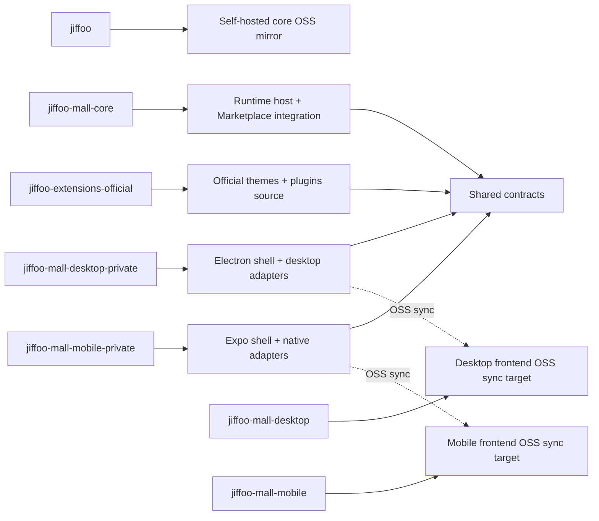

# Multi-Surface Solution Architecture Design

## Overview

Jiffoo should reuse **contracts and solution composition**, not force one page tree to run across every surface.

The design principle is:

- share contracts
- separate renderers
- let each host optimize for its platform

This keeps Web, Desktop, and Mobile aligned at the business level while preserving the freedom to ship a better surface-specific UX.

## Repository topology



Repository responsibilities:

- `jiffoo`
  - public OSS self-hosted core mirror
  - `api / admin / shop`
  - public SDKs and default fallback theme
- `jiffoo-mall-core`
  - runtime host
  - Marketplace control-plane integration
  - installer / verification / artifact delivery
  - managed package / solution activation
- `jiffoo-extensions-official`
  - official theme and plugin authoring
  - shared extension metadata
  - optional surface adapters owned by official extensions
- `jiffoo-mall-desktop-private`
  - private development repo for the Electron shell
  - desktop-only integrations and release pipeline
  - `desktop-web` adapters
- `jiffoo-mall-mobile-private`
  - private development repo for the Expo / React Native shell
  - native navigation and device integrations
  - `shop-native` and `mobile-native` adapters
- `jiffoo-mall-desktop`
  - desktop frontend OSS sync target
- `jiffoo-mall-mobile`
  - mobile frontend OSS sync target

Sync direction:

- `jiffoo-mall-core` -> public `jiffoo`
- `jiffoo-mall-desktop-private` -> public `jiffoo-mall-desktop`
- `jiffoo-mall-mobile-private` -> public `jiffoo-mall-mobile`

Desktop/mobile public repos are frontend/client-host outputs only. They do not become the source repo for `api`, `admin`, `shop`, Marketplace orchestration, or other runtime services.

Recommended local workspace layout:

- `/Users/jordan/Projects/jiffoo-mall-core`
- `/Users/jordan/Projects/jiffoo-extensions-official`
- `/Users/jordan/Projects/jiffoo-mall-desktop`
- `/Users/jordan/Projects/jiffoo-mall-mobile`

Keep them as sibling directories so cross-repo tooling, manual debugging, and AI-assisted development all operate against a predictable composite workspace.

The local folder names may omit the `-private` suffix for convenience, but the canonical authoring remotes for desktop/mobile still point to `jiffoo-mall-desktop-private` and `jiffoo-mall-mobile-private`. Public `jiffoo-mall-desktop` / `jiffoo-mall-mobile` remotes should remain separate OSS-sync targets.

## Layer model

### 1. Shared contract layer

This is the reusable core that should be shared everywhere:

- API DTOs and SDKs
- theme manifest and token schema
- plugin manifest and capability schema
- content/block schema
- navigation and deep-link intents
- solution package manifest
- compatibility/version metadata

This layer is where AI-generated apps should compose from first.

### RuntimeSnapshot read model

All surfaces should read one product-shape snapshot instead of reconstructing state independently.

Recommended shape:

```ts
type RuntimeSnapshot = {
  store: StoreContext
  solution: SolutionPackage
  theme: ActiveTheme
  plugins: EnabledPlugin[]
  branding: BrandingProfile
  platformBranding: {
    mode: 'oss' | 'managed'
    showPoweredByJiffoo: boolean
    poweredByHref?: string | null
    poweredByLabel?: string | null
  }
  surfaces: {
    web: SurfaceProfile
    desktop: SurfaceProfile
    mobile: SurfaceProfile
  }
}
```

Where:

- `store` is the current store/site context
- `solution` is the active composition bundle
- `theme` is the active theme selection
- `plugins` is the currently enabled capability set
- `branding` is the resolved brand projection
- `platformBranding` is the runtime attribution/managed-mode projection that lets each surface decide whether open-source `Powered by Jiffoo` attribution should remain visible
- `surfaces` carries per-surface availability and adapter state

Control-plane rule:

- `Admin` is the primary write surface that changes the inputs behind `RuntimeSnapshot`
- Web/Desktop/Mobile are runtime consumers of the same underlying snapshot

### 2. Surface adapter layer

Adapters translate the shared contracts into surface-specific rendering and interaction.

Supported adapter families:

- `shop-web`
- `admin-web`
- `desktop-web`
- `shop-native`
- `mobile-native`

Adapter rules:

- adapters may differ in routing, layout, and interaction design
- adapters must honor the shared contract layer
- adapters are optional per extension/surface pair
- missing adapters are a capability declaration, not an architecture failure

### 3. Host layer

The host is the runnable application shell:

- Web host: `shop`, `admin`, `super-admin`, `developer-portal`
- Desktop host: Electron shell
- Mobile host: Expo / React Native shell

Host responsibilities:

- auth/session lifecycle
- runtime bootstrapping
- platform/device integration
- updater/release plumbing
- error handling and observability

## Theme model

Themes should evolve from “a bag of web pages” into a layered package:

- `theme manifest`
- `brand tokens`
- `assets`
- `content/block schema`
- optional `surface adapters`

Preferred cross-surface rule:

- `Theme Pack` is the universal/default path for Web, Desktop, and Mobile
- executable theme runtimes are an additional path, not the baseline requirement

Minimum `Theme Pack` contract:

```ts
type ThemePackManifest = {
  slug: string
  name: string
  version: string
  target: 'shop' | 'admin'
  entry: {
    tokensCSS?: string
    templatesDir?: string
    assetsDir?: string
    settingsSchema?: string
  }
  compatibility?: {
    minCoreVersion?: string
  }
  adapters?: {
    web?: 'shop-web' | 'admin-web'
    desktop?: 'desktop-web'
    mobile?: 'shop-native' | 'mobile-native'
  }
}
```

Minimum package contents:

- `theme.json`
- `tokens.css` or equivalent token payload
- template/block resources when the theme customizes page structure
- assets when the theme ships visual resources

Operational consequence:

- `Theme Pack` is the default fast-update vehicle across Web/Desktop/Mobile
- changing active theme in `Admin` should change the next `RuntimeSnapshot` read for every surface

Examples:

- a desktop-ready theme may reuse `shop-web` inside Electron
- a mobile-ready theme may use the same tokens and blocks but ship `shop-native`
- a single solution package may activate one `Theme Pack` across all three surfaces while selecting different adapters per surface

This avoids forcing React DOM or Next.js page structures into mobile contexts where they do not fit.

## Plugin model

Plugins should be modeled as capability packages first, UI packages second.

Recommended plugin package structure:

- `plugin manifest`
- `capability contract`
- `config schema`
- `event/action hooks`
- optional `admin-web` / `desktop-web` / `mobile-native` surfaces

Minimum capability contract:

```ts
type PluginCapabilityManifest = {
  slug: string
  name: string
  version: string
  capabilities: string[]
  configSchema?: Record<string, unknown>
  surfaces?: {
    web?: 'required' | 'optional' | 'unsupported'
    desktop?: 'required' | 'optional' | 'unsupported'
    mobile?: 'required' | 'optional' | 'unsupported'
  }
}
```

Practical rule:

- Web/Desktop may expose full admin workspace surfaces
- Mobile may expose a companion surface, status surface, or narrow action sheet instead of full merchant admin parity
- Desktop may support richer executable plugin behavior when Electron shell capabilities are needed
- Mobile should default to declarative plugin behavior driven by capability metadata, remote config, and server/API orchestration

## Desktop model

Desktop should stay Web-heavy and shell-native:

- Electron as host shell
- `desktop-web` or `shop-web` adapters for main commerce/admin surfaces
- desktop-specific bridges for:
  - filesystem
  - notifications
  - printing
  - auto-update
  - background tasks

This maximizes reuse while keeping desktop capabilities available where needed.

Theme/plugin implication for Desktop:

- Desktop can feel close to the Web extension model
- installing a theme/plugin may immediately swap visible product surfaces when the desktop shell is already rendering `desktop-web` or `shop-web`
- executable desktop-side adapters are acceptable when justified by native integration needs

## Mobile model

Mobile should stay native-first:

- Expo / React Native as host shell
- `shop-native` and `mobile-native` adapters
- shared business contracts with Web/Desktop
- no assumption that theme pages written for Web DOM can run directly on mobile

This keeps mobile experience aligned with native expectations around navigation, performance, gestures, and device APIs.

Theme/plugin implication for Mobile:

- Mobile should support rapid product-surface changes through `Theme Pack`, tokens, assets, block/template schema, and remote config
- Mobile should not rely on arbitrary downloaded runtime code as the default extension model
- declarative plugin surfaces, companion views, and server-driven capability toggles are the preferred path

### Phase-1 capability matrix

| Capability | Web | Desktop | Mobile |
|---|---|---|---|
| Read `RuntimeSnapshot` | Required | Required | Required |
| Theme Pack switching | Required | Required | Required |
| Brand/config refresh | Required | Required | Required |
| Full admin plugin workspace | Required | Optional/Preferred | Not required |
| Companion plugin surface | Optional | Optional | Required path |
| Executable theme/plugin surface | Allowed | Allowed | Not default |
| Declarative capability/config-driven plugin behavior | Allowed | Allowed | Required path |

Phase-1 interpretation:

- Desktop should feel close to Web for storefront/admin extension experiences
- Mobile should feel consistent in brand and capability state, but it does not need full merchant-admin parity in phase 1

## Solution package model

A `solution package` is the preferred top-level composition unit for rapid application launch.

```ts
type SolutionPackage = {
  slug: string
  version: string
  brand: BrandProfile
  theme: ThemeSelection
  plugins: PluginSelection[]
  surfaces: SurfaceProfile[]
  environmentPreset?: EnvironmentPreset
  support?: SupportProfile
}
```

Where:

- `brand` controls naming, tokens, and presentation defaults
- `theme` selects the default theme and allowed theme adapters
- `plugins` define bundled capabilities
- `surfaces` declare which adapters exist for web/desktop/mobile
- `environmentPreset` captures deployment defaults or provisioning hints

This is the abstraction AI-assisted creation should target:

- generate a solution package
- bind it to a repo topology
- emit the right theme/plugin adapters per surface
- deploy or publish the resulting application

## Development workflow

Default workflow:

1. keep the main orchestration discussion in `jiffoo-mall-core`
2. route implementation to the canonical repo:
   - official theme/plugin source -> `jiffoo-extensions-official`
   - desktop shell / desktop adapters -> `jiffoo-mall-desktop-private`
   - mobile shell / native adapters -> `jiffoo-mall-mobile-private`
   - runtime / installer / Marketplace / managed package logic -> `jiffoo-mall-core`
3. keep repo ownership explicit in summaries, changelogs, and Linear work items

This preserves a single planning context without reintroducing double-write source drift.

## Delivery implications

- platform deployment still centers on `jiffoo-mall-core`
- official extension releases originate from `jiffoo-extensions-official`
- desktop/mobile ship on their own release pipelines
- solution packages and managed packages should reference versioned assets across these repos through explicit manifests, not implicit page-copy assumptions

## Non-goals

This design does not require:

- one page tree shared across all surfaces
- mobile parity with every desktop/web admin surface
- moving desktop/mobile into the core monorepo
- re-centralizing official extension authoring back into `jiffoo-mall-core`
